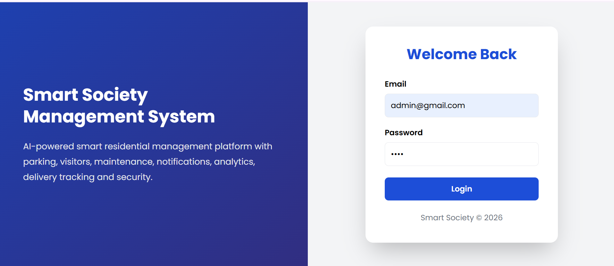
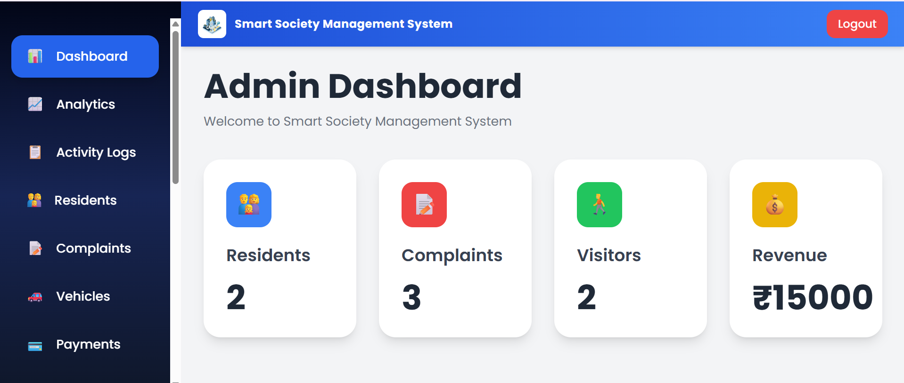
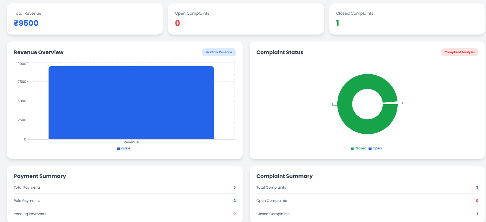
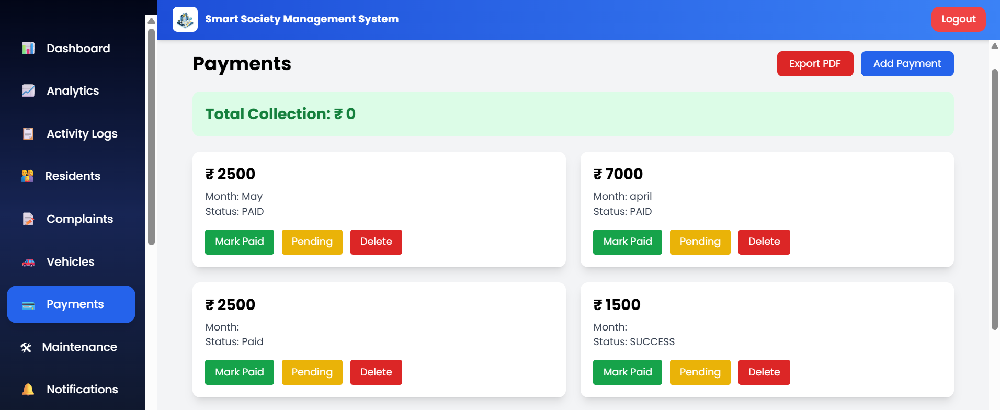
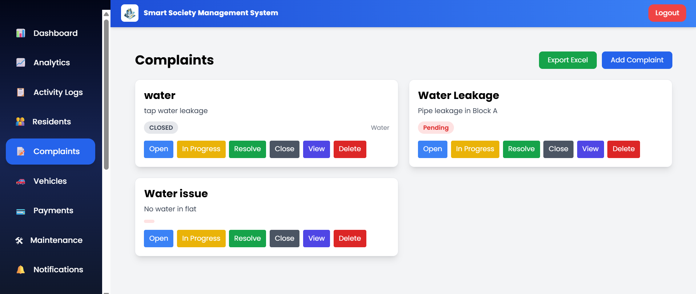
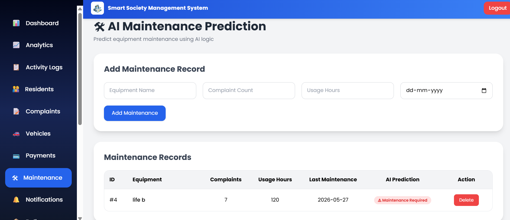
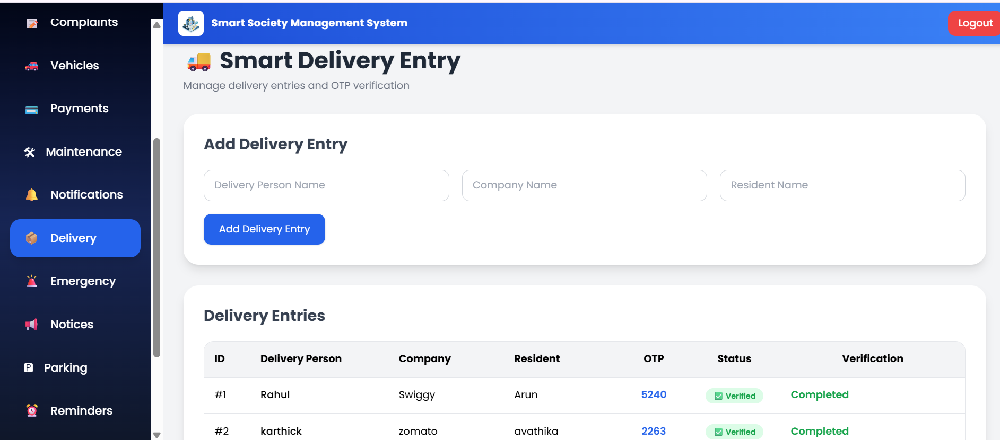
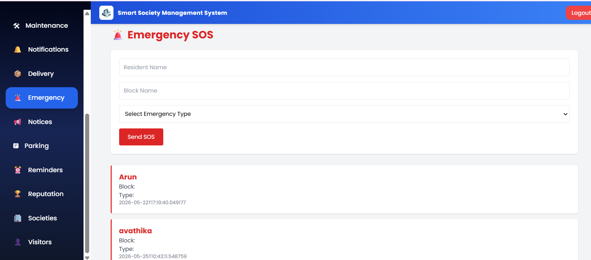
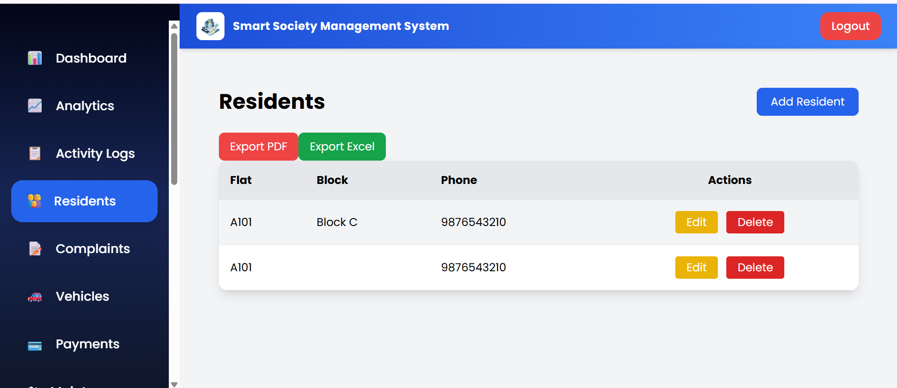
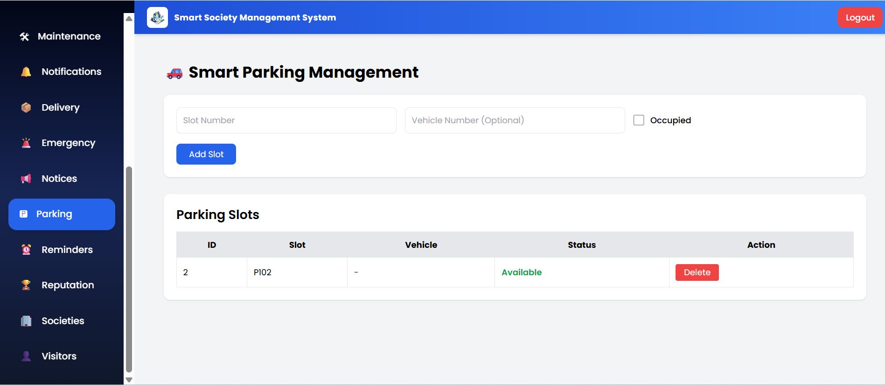

# 🏢 Smart Society Management System

A full-stack web application designed to streamline apartment and society management operations. The system provides role-based access for Admins, Residents, and Security personnel, enabling efficient management of residents, complaints, visitors, payments, notifications, parking, deliveries, and more.

## 🚀 Features

### 🔐 Authentication & Security
- JWT Authentication
- Role-Based Access Control (Admin, Resident, Security)
- Protected Routes

### 👥 Resident Management
- Add, Edit, Delete Residents
- Resident Profile Management
- Resident Dashboard

### 📝 Complaint Management
- Raise Complaints
- Track Complaint Status
- Resolve Complaints
- Complaint History

### 🚶 Visitor Management
- Visitor Registration
- OTP Verification
- Visitor Approval Workflow
- Security Dashboard Integration

### 💳 Payment Management
- Maintenance Payment Tracking
- Payment Records
- Payment Status Management

### 📢 Notifications
- Create Notifications
- Edit Notifications
- Delete Notifications
- Society Announcements

### 🚗 Vehicle & Parking Management
- Vehicle Registration
- Parking Allocation
- Vehicle Tracking

### 📦 Delivery Management
- Delivery Tracking
- Delivery Status Updates

### 🚨 Emergency Module
- Emergency Contact Information
- Emergency Alerts

### 📊 Analytics Dashboard
- Resident Statistics
- Complaint Analytics
- Payment Analytics
- Visual Charts & Reports

### 📋 Audit Logs
- Activity Tracking
- User Action History
- System Audit Trail

### 📄 Export Features
- Export Data to PDF
- Export Data to Excel

### 📧 Email Notifications
- Complaint Confirmation Emails
- Payment Confirmation Emails
- Visitor Approval Notifications

---

## 🛠️ Tech Stack

### Frontend
- React.js
- React Router DOM
- Axios
- Tailwind CSS

### Backend
- Spring Boot
- Spring Security
- JWT Authentication
- REST APIs

### Database
- MySQL

### Additional Libraries
- JavaMailSender
- jsPDF
- xlsx
- FileSaver

---

## 🚀 Future Enhancements

- 🔔 Real-time notifications using WebSockets
- 📱 Mobile application for Android and iOS
- 💬 In-app chat between residents, management, and security
- 🌐 Multi-society management support
- 📍 Visitor live tracking and QR code-based entry system
- 📹 CCTV integration for enhanced security monitoring

## 📸Screenshoots
 

  
  

  
  

  
  

  
  

  
  

